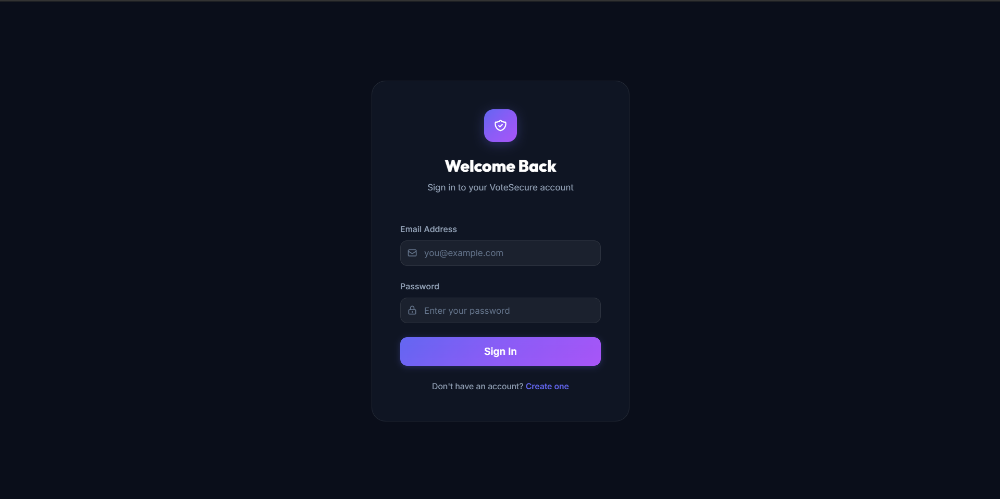
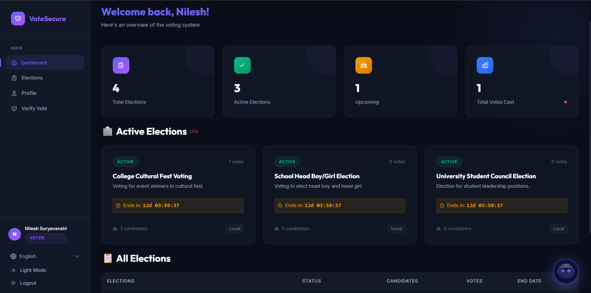
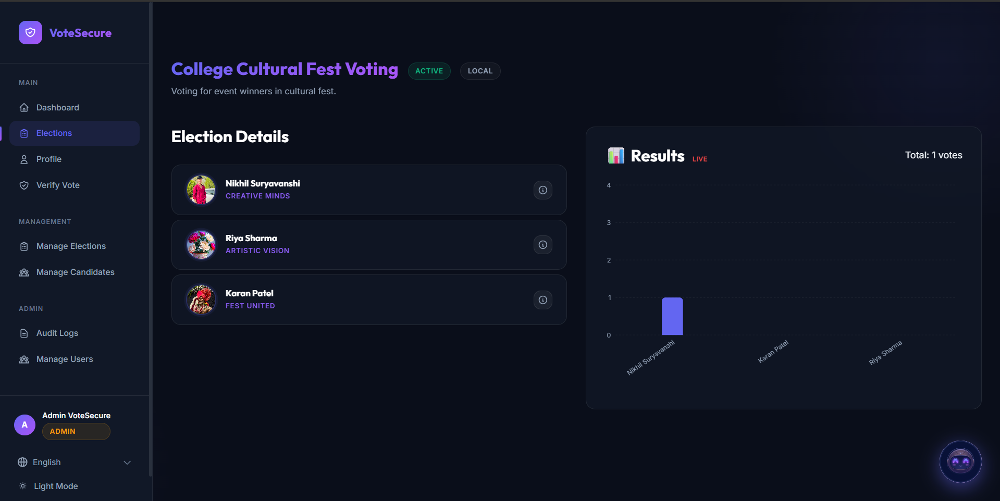

# 🗳️ VoteSecure: Next-Gen Online Voting System

[](https://reactjs.org/)
[](https://nodejs.org/)
[](https://www.postgresql.org/)
[](https://supabase.com/)
[](https://redis.io/)
[](https://socket.io/)

## 🌟 Overview

**VoteSecure** is a robust, transparent, and highly secure online voting platform designed to eliminate the pitfalls of traditional paper-based systems. Whether it's for student councils, corporate board elections, or community polls, VoteSecure provides a seamless digital experience with real-time results and multi-language support.

Built with a focus on **Security, Transparency, and User Experience**, the system leverages modern technologies like React, Node.js, and Supabase to ensure every vote is counted accurately and securely.

---

## ✨ Key Features

### 👤 Voter Experience

- **Interactive Voter Portal**: A clean, intuitive interface for voters to browse active elections.
- **Detailed Candidate Profiles**: Comprehensive candidate views including bios, professional history, and social links.
- **Secure Authentication**: JWT-based authentication with secure cookie storage and password hashing.
- **Multi-Language Support**: Fully localized in **English, Hindi, and Marathi** for better accessibility.

### 🛡️ Administrative Power

- **Intuitive Admin Dashboard**: Manage elections, candidates, and voters with ease.
- **Real-Time Analytics**: Dynamic results visualization using vertical bar charts (Recharts) powered by Socket.io.
- **Candidate Management**: Rich profile management with image uploads integrated via Cloudinary.
- **Automated Workflows**: Background job processing using BullMQ and Redis for high-performance tasks.

### 🤖 Intelligent Features

- **Integrated Chatbot**: A custom-designed AI assistant with a unique visual identity to help users navigate the platform.
- **Real-Time Notifications**: Instant updates on election status and results via web sockets.
- **Responsive Design**: Optimized for desktop, tablet, and mobile viewing.

---

## 🛠️ Tech Stack

### Frontend

- **Framework**: React 19 (Vite)
- **Styling**: Vanilla CSS with modern aesthetics (Glassmorphism, Dark Mode)
- **Animations**: Framer Motion
- **Icons**: Lucide React & React Icons
- **Visualization**: Recharts
- **Communication**: Axios & Socket.io-client

### Backend

- **Runtime**: Node.js (Express 5.x)
- **Database**: PostgreSQL (Supabase)
- **Caching/Queuing**: Redis + BullMQ
- **Storage**: Cloudinary (Image management)
- **Security**: JWT, Bcrypt, Helmet, Express Rate Limit
- **Communication**: Socket.io & Nodemailer

### Infrastructure

- **Containerization**: Docker & Docker Compose
- **Deployment**: Production-ready architectural patterns

---

## 🚀 Getting Started

### Prerequisites

- [Node.js](https://nodejs.org/) (v18+)
- [Docker](https://www.docker.com/) (optional, for localized setup)
- [PostgreSQL](https://www.postgresql.org/) or [Supabase](https://supabase.com/) account
- [Cloudinary](https://cloudinary.com/) account for image storage
- [Redis](https://redis.io/) (for queuing)

### 📂 Repository Structure

```text
Online-voting-system/
├── client/          # Vite + React Frontend
├── server/          # Node.js + Express Backend
├── docker-compose.yml
└── README.md
```

### ⚙️ Installation

1. **Clone the repository:**

   ```bash
   git clone https://github.com/your-username/Online-voting-system.git
   cd Online-voting-system
   ```

2. **Setup Backend:**

   ```bash
   cd server
   npm install
   ```

   Create a `.env` file in the `server` directory and fill in your credentials (see `.env.example`).

3. **Setup Frontend:**

   ```bash
   cd ../client
   npm install
   ```

4. **Run Locally:**
   - **Start Backend:** `npm run dev` (runs on port 3001)
   - **Start Frontend:** `npm run dev` (runs on port 5173)

---

## 🐳 Docker Deployment

To spin up the entire application along with dependencies using Docker:

```bash
docker-compose up --build
```

---

## 📸 Screenshots

|       Login Page       |     Voter Dashboard      |     Admin Analytics      |
| :--------------------: | :----------------------: | :----------------------: |
|  |  |  |

---

## 🤝 Contributing

Contributions are welcome! Please feel free to submit a Pull Request.

---

## 📜 License

This project is licensed under the **ISC License**.

---

Developed with ❤️ as a secure solution for modern democracy.
